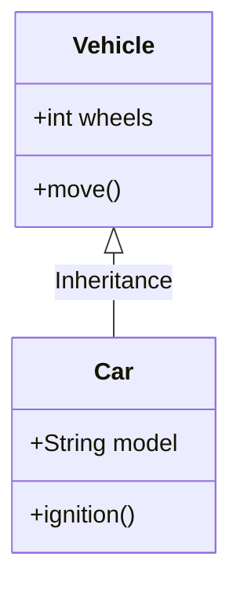

# Class Diagrams

Class diagrams model the structure of a system by showing its classes, attributes, methods, and the relationships between objects.

## How to Start
- Use the keyword `classDiagram`.
- Define class names and their content (attributes/methods).
- Connect classes to show how they relate.

## Simple Example


## Syntax Guide

### 1. Defining Classes
You can define a class block as follows:
```mermaid
class MyClass {
    +String name
    -int age
    #calculate() 
}
```

### 2. Visibility
- `+` Public
- `-` Private
- `#` Protected
- `~` Package / Internal

### 3. Relationships
- `A <|-- B`: Inheritance (is a)
- `A *-- B`: Composition (part of)
- `A o-- B`: Aggregation
- `A --> B`: Association
- `A .. B`: Dependency (Dashed)
