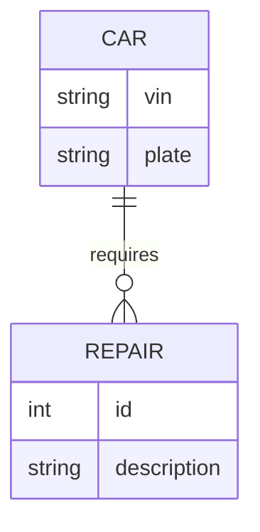

# Entity Relationship (ER)

ER diagrams show how entities relate to each other, typically representing a database schema.

## How to Start
- Use the keyword `erDiagram`.
- Define entities and their attributes (optional).
- Specify relationships and their cardinality.

## Simple Example

## Syntax Guide

### 1. Cardinality Symbols
- `||` : Exactly One
- `|{` : One or More
- `o{` : Zero or More
- `|o` : Zero or One

### 2. Layout
- `EntityA [Relationship Symbol] EntityB : "Label"`

### 3. Entity Attributes
Attributes are defined within curly braces:
- `type name`
- `type name PK` (Primary Key)
- `type name FK` (Foreign Key)
