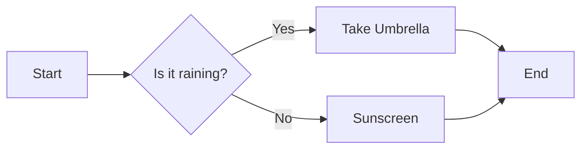

# Flowcharts

Flowcharts are used to visualize workflows, logic, or processes. They consist of **Nodes** (shapes) and **Edges** (lines/arrows).

## How to Start
- Declare the type: `flowchart` or `graph`.
- Set the direction: `TD` (Top-Down) or `LR` (Left-Right).
- Define connections using identifiers.

## Simple Example

## Syntax Guide

### 1. Node Shapes
Define a node by its ID and surround the label with specific brackets:
- `ID[Rectangle]` - Standard box
- `ID(Rounded)` - Rounded corners
- `ID{Diamond}` - Decision point
- `ID((Circle))` - Perfect circle
- `ID[[Subroutine]]` - Double-lined box
- `ID[/Parallelogram/]` - Input/Output
- `ID[\Trapezoid/]` - Manual operation

### 2. Connection Styles (Edges)
- `A --> B` : Standard arrow
- `A --- B` : Simple line (no arrow)
- `A -- Text --> B` : Arrow with text label
- `A ==> B` : Thick bold arrow
- `A -.-> B` : Dotted/Dashed arrow

### 3. Directions
- `TD` or `TB`: Top to Down
- `BT`: Bottom to Top
- `LR`: Left to Right
- `RL`: Right to Left
