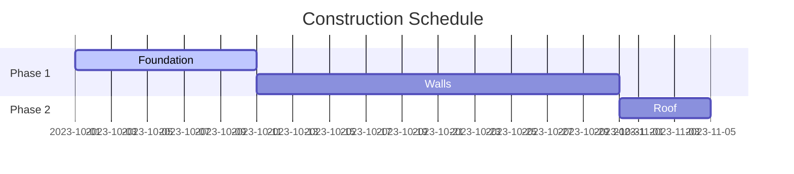

# Gantt Charts

Gantt charts are used for project management to schedule tasks over time.

## How to Start
- Use the keyword `gantt`.
- Define a `dateFormat`.
- Add `sections` to group tasks.
- Add tasks with a name, status/alias, and duration.

## Simple Example

## Syntax Guide

### 1. Task Definitions
`Task Name : [status], [alias], [start-date], [duration]`
- **Status**: `active`, `done`, `crit` (critical).
- **Alias**: Reference tasks later (e.g., `after a1`).
- **Duration**: `5d` (days), `2h` (hours), `1w` (weeks).

### 2. Configurations
- `dateFormat`: e.g., `YYYY-MM-DD`.
- `axisFormat`: Determines timeline appearance (e.g., `%m-%d`).
- `excludes`: Skip days like `weekends`.
