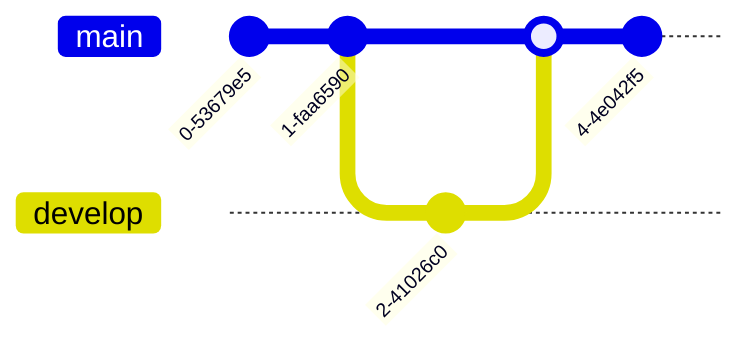

# Git Graphs

Git graphs visualize repository history, including commits, branches, and merges.

## How to Start
- Use the keyword `gitGraph`.
- Add commits sequentially.
- Manage branches and merges.

## Simple Example

## Syntax Guide

### 1. Basic Actions
- `commit`: Adds a commit to the current branch.
- `branch [name]`: Creates a new branch.
- `checkout [name]`: Switches focus to a branch.
- `merge [name]`: Merges a branch into the current one.

### 2. Customizing Commits
- `commit id: "fix-1"`: Manually set a commit ID.
- `commit tag: "1.0"`: Add a tag to a commit.
- `commit type: HIGHLIGHT`: Change the visual style.

### 3. Advanced
- `cherry-pick id: "abc"`: Duplicate a commit onto the current branch.
