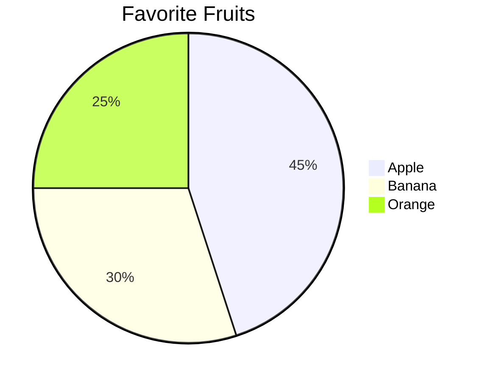

# Pie Charts

Pie charts visualize data as slices of a whole.

## How to Start
- Use the keyword `pie`.
- Add a `title` (optional).
- Add data rows: `"Label" : Value`.

## Simple Example

## Syntax Guide

### 1. Data Input
Values are numeric, and Mermaid calculates percentages automatically.
- Labels must be enclosed in double quotes `"`.
- Use a colon `:` between the label and the value.

### 2. Best Practices
- Keep label names concise.
- Limit the number of slices (2-7 is ideal) for better readability.
