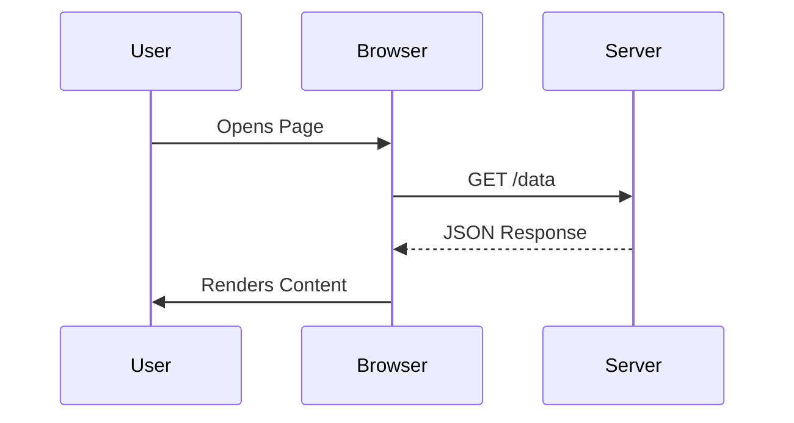

# Sequence Diagrams

Sequence diagrams show how different parts of a system (Participants) interact and in which order.

## How to Start
- Start with the keyword `sequenceDiagram`.
- List your `participants` (optional, but good for clarity).
- Draw arrows between participants to show messages.

## Simple Example

## Syntax Guide

### 1. Participants & Actors
- `participant Alice`: Creates a standard square box.
- `actor Bob`: Creates a "stick figure" icon.
- `participant A as Alice`: Use aliases for shorter code.

### 2. Message Types (Arrows)
- `A -> B`: Solid line (no arrow)
- `A ->> B`: Solid line with arrow (Synchronous)
- `A -->> B`: Dotted line with arrow (Asynchronous Response)
- `A -x B`: Solid line with a cross (Deactivation)

### 3. Features
- **Notes**: `Note over Alice,Bob: They are talking.`
- **Activation**: `activate Alice` or `A->>+B` (The `+` adds the activation bar).
- **Loops**: `loop Every Minute ... end`
- **Conditions**: `alt is Success ... else is Error ... end`
