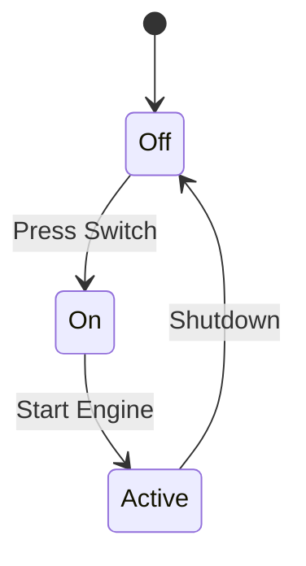
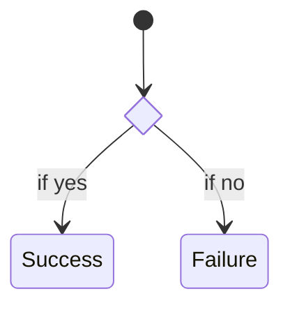

# State Diagrams

State diagrams describe the different states a system can be in and how it transitions from one state to another.

## How to Start
- Use the keyword `stateDiagram-v2`.
- Use `[*]` to represent the starting point and ending point.
- Define transitions with `-->`.

## Simple Example


## Syntax Guide

### 1. States & Labels
- `[*] --> StateName`: Initial state transition.
- `StateName --> [*]`: Final state transition.
- `State1 --> State2 : Description`: A labeled transition.

### 2. Composite States
Nesting states inside another:
```mermaid
state Machine {
    Idle --> Working
    Working --> Error
}
```

### 3. Decisions
Use `state choice_name <<choice>>` to create a diamond decision point.

