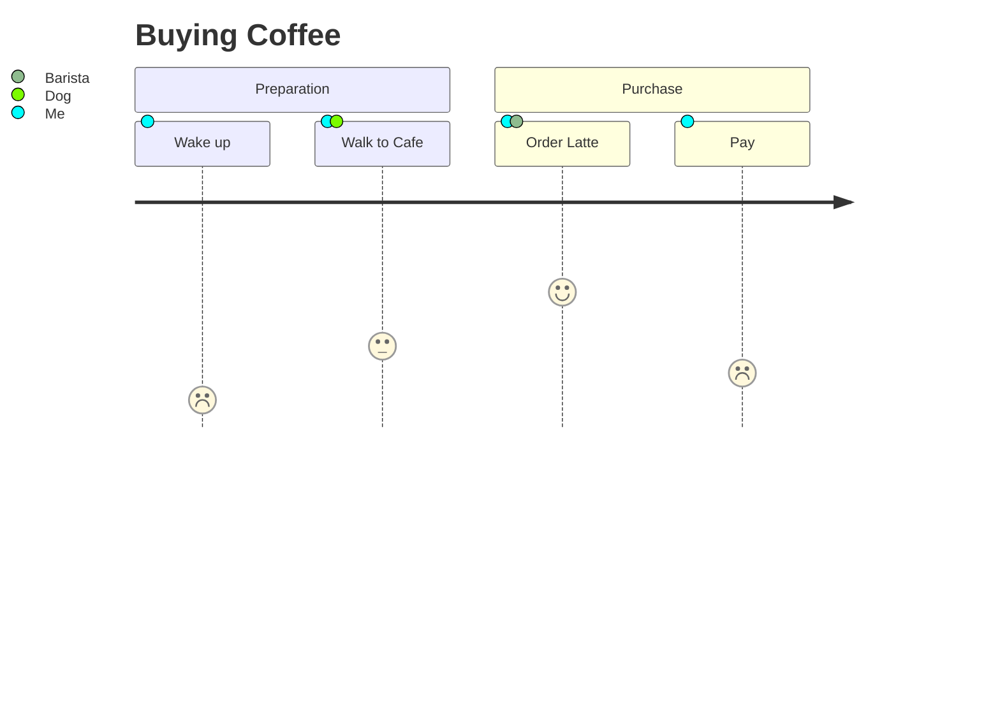

# User Journeys

User journey diagrams describe steps to complete a goal and the happiness score at each step.

## How to Start
- Use the keyword `journey`.
- Add a `title`.
- Group steps with `section`.
- Add tasks with a score (0-5) and actors.

## Simple Example

## Syntax Guide

### 1. Task Definition
- `Task name : [Score] : [Actors]`

### 2. Happiness Scores (0 to 5)
- `5`: Very Happy
- `3`: Neutral
- `1`: Frustrated
- `0`: Failed / Worst

### 3. Structure
Use `section Name` to categorize groups of tasks into visual headers.
