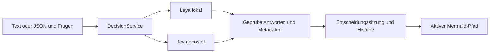

# Jev und Laya: gemeinsame Entscheidungsprovider

Stand: 01.10.2026. Gewünschtes Produktverhalten: lokale und gehostete
Entscheidungsmodelle auswählbar machen, analog zur bestehenden Auswahl zwischen
Ollama und OpenAI. Diese Datei beschreibt die recherchierte Integrationsarchitektur;
die Provider sind noch nicht in die Anwendung eingebaut.

## Verifizierte Quellen

| Quelle | Verifizierter Befund |
| --- | --- |
| [Jev-Dokumentation](https://jevmodel.org/docs/) | Vom Nutzer genannt; direkter Abruf in dieser Umgebung durch Netzwerkpolicy blockiert |
| [Offizielles TypeSafe-JavaScript-SDK](https://github.com/typesafe-ai/typesafe-sdk-js) | Version 0.6.0, Commit `66880ccded6cb642dc1809620c2b108c33730214`; Request, Typen, Transport und Lizenz gelesen |
| [Laya auf PyPI](https://pypi.org/project/laya/) | Version 0.3.22, Python >=3.10, Apache-2.0; optionale HTTP-, MCP- und ONNX-Pakete |
| [Laya auf Hugging Face](https://huggingface.co/convaiinnovations/laya) | Offene Modellgewichte, Apache-2.0, ca. 421 Mio. Parameter, Klassifikationsmodell |
| [Laya-Quellen](https://github.com/NandhaKishorM/laya) | Version 0.3.22, Commit `6d942c92081fbc139e736bbd9ac0023223c29b7f`; HTTP-Server, SDK und Dokumentation gelesen |
| [Laya HTTP-Vertrag](https://github.com/NandhaKishorM/laya/blob/6d942c92081fbc139e736bbd9ac0023223c29b7f/docs/http-api.md) | Explizite Jev-Protokollkompatibilität, Modellrouting, Ergebnisse und Konfidenzunterschiede |

Jevs SDK ist MIT-lizenziert. Damit ist nicht belegt, dass die gehosteten
Jev-Modellgewichte offen verfügbar sind. Laya ist ein eigenständiges lokales Modell
mit passender Schnittstelle. Eine Live-Jev-Anfrage und lokale Laya-Inferenz wurden
hier nicht durchgeführt; es wurden keine Modellgewichte heruntergeladen.

## Zwei unabhängige Provider-Auswahlen

| Aufgabe | Lokaler Provider | Gehosteter Provider |
| --- | --- | --- |
| Text, Erklärungen und Mermaid-Code erzeugen | Ollama | OpenAI/Codex |
| Definierte Entscheidungen aus Text/JSON bewerten | Laya | Jev/TypeSafe |

Chatprovider und Entscheidungsprovider werden unabhängig gewählt. So kann
beispielsweise Ollama das Diagramm erzeugen und Jev dessen Entscheidungsfragen
bewerten; ebenso kann OpenAI mit lokalem Laya kombiniert werden.
Embeddings behalten ihre bestehende eigene Konfiguration.

Die Modelle beantworten Fragen mit vorgegebenen Antwortmöglichkeiten. Für frei
formulierte Erklärungen und die erste Übersetzung einer Idee in Mermaid bleibt
die generative Provider-Schicht zuständig. Die Auswahl einer vorhandenen Option
kann unmittelbar ohne Modellaufruf dargestellt werden.

## Gemeinsamer HTTP-Vertrag

| Eigenschaft | Jev, gehostet | Laya, lokal |
| --- | --- | --- |
| Basis-URL | `https://api.typesafe.ai` laut offiziellem SDK | `http://127.0.0.1:8000` für Mermaider vorgeschlagen |
| Entscheidung | `POST /v1/systemone` | `POST /v1/systemone` |
| Authentifizierung | `Authorization: Bearer <API-Key>` | Optionaler Bearer-Key, wenn `LAYA_API_KEY` gesetzt ist |
| Modellauswahl | SDK-Standard `jev-latest`; verfügbare IDs über `GET /v1/models` | `english`, `multilingual`, `typed-decisions` bzw. veröffentlichte IDs; automatisches Routing bei fehlendem Modell |
| Verbindungstest | Modellliste bzw. gezielte Testfrage | `GET /health`, anschließend gezielte Testfrage |

Gemeinsame minimale Anfrage:

```json
{
  "state": {"update": "Das Budget wurde freigegeben."},
  "questions": {
    "budget": {
      "type": "choice",
      "instructions": "Welcher Budgetzustand wird ausdrücklich beschrieben?",
      "criteria": {
        "approved": "Budget wurde freigegeben",
        "rejected": "Budget wurde abgelehnt",
        "unknown": "Keine eindeutige Entscheidung genannt"
      }
    }
  }
}
```

`model` wird je Provider gesetzt, nicht beim Umschalten übernommen. Ein Jev-Modellname
wird von Laya gegebenenfalls als automatische Routingwahl interpretiert; das könnte
eine falsche Konfiguration verstecken. Gemeinsame Zustände auf Text, JSON-Objekt oder
Array begrenzen: Laya weist einen fehlenden oder `null`-Zustand zurück.

## Antworten normalisieren und visualisieren

| Primitive | Gemeinsames Ergebnis | Mermaid-Darstellung |
| --- | --- | --- |
| `choice` | Ausgewähltes Label und Wahrscheinlichkeitsverteilung über die vorgegebenen Optionen | Entscheidungsknoten, aktive Kante, optionale Verteilung |
| `score` | Erwarteter Index einer geordneten Rubrik, Legend und Verteilung | Bewertungslabel; Grenzwerte und resultierende Kante liegen im Appmodell |
| `noul` | Wahrscheinlichkeit der positiven Aussage von 0 bis 1 | Bedingungsknoten mit expliziter Ja-/Nein-/Unklar-Regel |

`score` ist keine Wahrscheinlichkeit und kann zwischen Rubrikstufen liegen.
`noul` ist eine Wahrscheinlichkeit, kein automatisch bestätigter Boolean.
Fehlende oder unbekannte Antworten verändern den aktiven Pfad nicht.

Die gemeinsame Antwortstruktur bewahrt:

- Provider, angefragtes und tatsächlich zurückgegebenes Modell.
- Bei Laya zusätzlich `routing.model`, `routing.repo`, Routinggrund und
  verfügbare Checkpointrevision aus dem Health-Ergebnis.
- Frage-ID, Primitive, Antwort, Verteilung und originale Konfidenzmetadaten.
- Lauf-ID, Bezug auf die Eingabeversion, Zeitpunkt, Transportdauer,
  gegebenenfalls Inferenzdauer und Tokenverbrauch.
- Die angewandte Entscheidungsregel und den vom Anwender übernommenen Pfad.

### Konfidenz nicht gleichsetzen

Layas Dokumentation beschreibt `confidence` für Choice/Score als normalisierte
Entropie und `answer_confidence` als maximale Wahrscheinlichkeitsmasse.
Sie beschreibt Jevs Konfidenz mit `(n * p_max - 1) / (n - 1)`; das offizielle
SDK definiert das Feld, aber keine Formel. Die Formelzuordnung für Jev deshalb
vor produktiver Nutzung zusätzlich anhand der aktuellen Anbieterunterlagen prüfen.

Konfidenzwerte mit ihrer Bedeutung speichern und anzeigen. Schwellenwerte getrennt
nach Provider, Modellversion, Primitive und Anwendungsfall prüfen. Bei Score gibt
`answer_confidence` die Masse der wahrscheinlichsten Rubrikstufe an, nicht die
Wahrscheinlichkeit, dass der erwartete Score korrekt ist. Bei Noul fehlt im Jev-
Vertrag ein verpflichtendes Konfidenzfeld; keines erfinden.

Laya dokumentiert zusätzliche Einschränkungen bei Noul und multilingualen
Score-Fragen. Für deutsche Texte den multilingualen Checkpoint bzw. dessen Routing
prüfen und repräsentative deutsche Beispiele testen. Die Konfiguration einer
hohen Schwelle ersetzt keine Messung der Entscheidungsqualität.

## Lokaler Betrieb wie bei Ollama

Für den ersten Integrationsschritt Laya als separat gestarteten lokalen Dienst
nutzen; Python/PyTorch und Gewichte nicht in den Tauri-Installer aufnehmen.

```bash
python -m pip install "laya[serve]==0.3.22"
LAYA_HOST=127.0.0.1 LAYA_PORT=8000 LAYA_MODELS=multilingual laya-serve
```

Das ist ein Beispiel für eine POSIX-Shell. Der Start kann Modelle herunterladen
und vorladen; Kaltstart und Warmstart getrennt messen. Laya bindet standardmäßig
an `0.0.0.0`; das obige Beispiel wählt ausdrücklich die lokale Loopback-Adresse.
Unter Windows dieselben Werte vor dem Start als Umgebungsvariablen setzen.

Später prüfen: direkte lokale ONNX-Inferenz über `laya-ts`. Das wäre eine eigene
Ausbaustufe mit Modellverteilung, Speicher-/Workerbedarf und Desktop-/Browserchecks;
die HTTP-Variante kann bereits den bestehenden Web-/Tauri-Transport nutzen.

## Integration in Mermaider

Vorgeschlagene Dateien und Verantwortlichkeiten, noch nicht implementiert:

| Bereich | Änderung |
| --- | --- |
| `src/decision/types.ts` | Gemeinsame Fragen, Antwortmetadaten, Providerkonfiguration und Lauf-/Pfadzustand |
| `src/decision/service.ts` | Providerwahl, Validierung, Abbruch/Timeout, Transport und Antwortprüfung |
| `src/decision/providers/jev.ts` und `laya.ts` | Providerabhängige Authentifizierung, Modelle, Healthcheck, Ergebnis-/Konfidenzmetadaten |
| `Settings.tsx` | Eigene Entscheidungssektion: deaktiviert/lokal/gehostet, Endpoint, Modell, Verbindungstest |
| Neuer Entscheidungspanel | State-Eingabe und bearbeitbare Fragen, Auswerten, Vorschläge/Pfade übernehmen, Historie |
| `src-tauri/src/lib.rs` | Eigene Jev-/Laya-Credential-Kommandos im Betriebssystemspeicher; keine Vermischung mit OpenAI-Secrets |
| `capabilities/default.json` | Geprüften Jev-API-Host ergänzen; bestehende Loopback-Bereiche für Laya verwenden |
| `App.tsx` und `types.ts` | Versionierte Entscheidungssitzung je Tab, Persistenzmigration und Rückgängig |
| `Preview.tsx` | Pfadhervorhebung unabhängig von Topologie; veraltete Antworten/Renderaufträge verwerfen |

Das Modell wird durch stabile IDs mit Diagrammknoten und Kanten verbunden.
Strukturierter Zustand ist die Quelle für Auswertung und Pfadhervorhebung.
Mermaid ist die Darstellung und das Exportformat. Freier Code und existierende
Diagramme müssen weiterhin nutzbar bleiben; der derzeitige Flowchart-Teilparser
ist wegen seiner Inline-Syntaxverluste noch keine zuverlässige Importgrundlage.



Für Desktop den vorhandenen nativen HTTP-Transport verwenden. Für Web Jev über
einen authentifizierten Proxy mit serverseitigem Schlüssel einplanen. Lokales Laya
braucht im Browser zusätzlich eine geprüfte CORS-/HTTPS-Lösung: Der untersuchte
Server aktiviert keine allgemeine CORS-Middleware. Das ist bei der ersten
Webintegration zu lösen, nicht durch das bloße Eintragen eines Endpoints.

Kein stiller Wechsel von lokalem Laya zu gehostetem Jev: Providerfehler werden
angezeigt, der bisherige Diagrammzustand bleibt erhalten. Eine spätere optionale
Fallbackfunktion muss ausdrücklich konfiguriert werden, weil sie den Datenweg ändert.

## Reihenfolge und Abnahme

1. Gemeinsamen Vertrag mit realistischen Jev-/Laya-Antwortfixtures prüfen:
   Choice, Score, Noul, unvollständige Antworten und fremde Options-IDs.
2. Desktop-Transport, Einstellungen, getrennte Credentials und Verbindungstests.
3. Kleines Entscheidungspanel mit stabiler Knotenzuordnung, Historie und
   sichtbarer Auswertung; manuelle Auswahl unmittelbar darstellen.
4. Auf beiden echten Providern Qualität, Deutsch, Warm-/Kaltstart und Latenz
   prüfen. Abbruch, schnelle Folgeeingaben, Providerwechsel und Fehler testen.
5. Browserproxy/CORS und öffentliche Bereitstellung integrieren.
6. Rendering separat optimieren; Modell-Inferenzzeiten sind keine End-to-End-
   Garantie für das sichtbare Diagramm.
