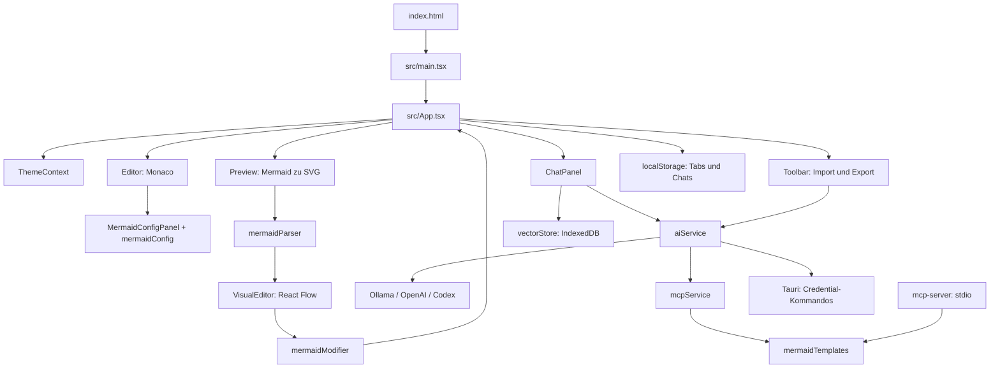

# Projektüberblick und verifizierter Stand

Erfasst am 30.09.2026. Grundlage für Bereitstellung, anschließenden Release
und Weiterentwicklung zu einem Werkzeug für visuelle Entscheidungen und Kommunikation.

Ergänzung vom 01.10.2026: Entscheidungsmodelle sollen über Jev als gehosteten
und Laya als lokalen Provider integriert werden. Die Schnittstellen wurden anhand
der offiziellen SDK-/Laya-Quellen untersucht. Die Implementierung steht aus;
siehe [Providerarchitektur](DECISION_PROVIDERS.md) und [Roadmap](ROADMAP.md).

## Stand und Builds

| Bereich | Verifizierter Stand |
| --- | --- |
| Repository | `Jakende/mermaider`, privat, Standardbranch `main` |
| Checkout | `work`, Commit `b0a673d`; Remote `main` ist derselbe Commit |
| Version | `1.8.6` in npm-, Tauri- und Rust-Manifesten |
| Letzter Release-Tag | `v1.8.6` auf `d6d9609`, 04.08.2026 |
| Änderungen nach Tag | README und zwei OpenAI-Websuche-Commits: `d1bbc21`, `1cf5d24`, `b0a673d` |
| Desktop-Build v1.8.6 | Erfolgreich auf macOS und Windows |
| Veröffentlichung | Alle 16 erfassten Releases sind Entwürfe, keiner veröffentlicht |
| Web-Deployment auf HEAD | Fehler beim Auflösen der Appwrite-Action, vor Checkout/Build |
| Lokaler Webbuild | Frisches `npm ci` und `npm run build` mit Node 20.20.2 erfolgreich; ursprünglicher Node-24-Build ebenfalls erfolgreich |
| Native Prüfung hier | Nicht ausgeführt: Rust/Cargo fehlen; keine aktuellen macOS-/Windows-Systemtests |

[Statussnapshot](status-2026-09-30.json) hält GitHub-Metadaten, Commitzuordnung,
Artefaktnamen, Größen, Prüfsummen und die letzten zwölf Workflow-Läufe fest.
Desktop-Prüfsummen stammen aus GitHub; Installer wurden hier nicht ausgeführt.

| Tag | Datum | Buildstatus | Releasezustand | Nachweis |
| --- | --- | --- | --- | --- |
| v1.8.6 | 04.08.2026 | erfolgreich, beide OS | Entwurf | [30918123075](https://github.com/Jakende/mermaider/actions/runs/30918123075) |
| v1.8.5 | 13.07.2026 | erfolgreich | Entwurf | [29228096498](https://github.com/Jakende/mermaider/actions/runs/29228096498) |
| v1.8.4 | 06.07.2026 | erfolgreich | Entwurf | [28786747674](https://github.com/Jakende/mermaider/actions/runs/28786747674) |

v1.8.6 enthält `Mermaider_1.8.6_aarch64.dmg`, `Mermaider_1.8.6_x64-setup.exe`
und `Mermaider_aarch64.app.tar.gz`. Der heutige Webbuild enthält zusätzlich
die Commits nach dem Tag und ist deshalb nicht identisch mit diesen Installern.

## Dateizusammenhänge

| Dateien/Gruppe | Aufgabe und Verbindungen |
| --- | --- |
| `index.html`, `src/main.tsx` | HTML, Metadaten, externe Fonts; React mit StrictMode, globale CSS-Dateien |
| `src/App.tsx`, `types.ts`, `App.css` | Tabs, Code, Chats, Panels, Kürzel, Fehler und Auto-AI-Fix; zentraler Zustand für Editor, Vorschau, Chat |
| `contexts/ThemeContext.tsx` | App-/Diagrammtheme und Textdarstellung; lokale Persistenz |
| `components/Editor.tsx` | Monaco-Sprachregeln, Marker, Codeänderungen, Node-Auswahl; zusätzlicher verzögerter Draft |
| `Preview.tsx`, `utils/mermaidThemes.ts` | Konfiguration, 500-ms-Debounce, SVG, Zoom/Pan, Node-Interaktion und Layoutpositionen |
| `VisualEditor.tsx`, `mermaidParser.ts`, `mermaidModifier.ts` | Flowchart-Teilparser, React-Flow-Graph, Änderungen am Originalcode; kein vollständiger Mermaid-Parser |
| `mermaidGenerator.ts` | Alternative Graphdaten-zu-Code-Konvertierung; ohne Import durch aktive Appdateien |
| `MermaidConfigPanel.tsx`, `mermaidConfig.ts` | UI und Parser/Serializer für Init-Block bzw. vereinfachtes YAML |
| `ChatPanel.tsx`, `aiService.ts` | Edit/Ask, Kontext, Providertransporte, Codebereinigung, Reparatur, Embeddings, OAuth, optionale Websuche |
| `Settings.tsx` | Provider, Modelle, Verbindungstest, Credentials, Device-Login; nutzt `aiService.ts` |
| `KnowledgeBaseModal.tsx`, `vectorStore.ts` | Import/Chunking/Embeddings, Quellenfilter, Suche; IndexedDB/localforage, vollständige Sammlung für Ähnlichkeitssuche |
| `Toolbar.tsx`, `ExportModal.tsx` | Öffnen, SVG/PNG/MMD/PDF und AI-Markdown-Berichte, AI-Fix; bindet Settings, Hilfe und Wissensbasis ein |
| `TabBar.tsx`, `ResizableSplitter.tsx` | Tabs und Panelgrößen; Zustand überwiegend in App |
| `NewDiagramModal.tsx`, `HelpModal.tsx`, `DiagramDocsModal.tsx` | Vorlagen und Hilfe: `mermaidTemplates.ts` und `public/diagram-docs/` |
| `mermaidCodeBlock.ts` | Extrahiert vollständig umschließenden Mermaid-Codeblock; Editor, Import und Vorschau teilen diese Logik |
| `mcpService.ts` | AI-Vorlagenkontext und grobe Startschlüsselwort-Prüfung |
| `src/mcp-server.ts` | Eigenständiger stdio-Prozess, `npm run mcp`; gemeinsame Vorlagen, separate grobe Validierung |
| `env.ts`, `.env.example` | Helfer ohne aktive Aufrufer und alte, ungenutzte Appwrite-Platzhalter |
| `src/assets/*.css`, `index.css`, `components/*.css` | Design-Tokens, gemeinsame und komponentenspezifische Darstellung |
| `src-tauri/src/main.rs`, `lib.rs`, `build.rs` | Rust-Einstieg, Tauri/HTTP, OpenAI-Secrets über keyring, Buildintegration |
| `tauri.conf.json`, `capabilities/default.json`, `icons/` | Fenster, Bundleziele, App-ID/Version, HTTP-Zielbereiche, Icons |
| `package*.json`, `Cargo.toml`, `Cargo.lock` | Skripte und gesperrte Abhängigkeiten für Frontend/Tools bzw. Desktop |
| `vite.config.ts`, `tsconfig*.json`, `vite-env.d.ts` | Root-Basis, Build nach `dist/`, Typprüfung und Vite-Typen |
| `eslint.config.js` | Alte JS/JSX-Konfiguration; ESLint-Pakete, TS/TSX-Unterstützung und npm-Lintskript fehlen |
| `public/` | Direkt kopierte Diagrammhilfen, Favicons, Robots, Sitemap, `_redirects` |
| `.github/`, `.agents/skills/auto-release/` | Workflows, Issuevorlagen; lokaler Release-Helper mit Versionierung, Checks, Commit/Tag/Push |
| `README.md`, `Docs_Mermaider.md`, `docs/`, `LICENSE` | Nutzer-/Entwicklerdokumentation; CC BY-NC-SA 4.0 mit nichtkommerzieller Einschränkung |
| `.test-compile/` | Eingecheckte ältere vollständige Kopie (npm 1.6.3), keine aktive Testsuite, nicht Teil des Root-Builds |

Vor diesem Arbeitslauf: 315 eingecheckte Dateien, davon 152 im aktiven
Quell-/Asset-/Workflow-/Skill-/Dokumentationsbereich. Viele weitere Dateien
gehören zur historischen Kopie. `node_modules/` und `dist/` sind ignoriert.

## Verifikation

Der Produktionsbuild typprüft Frontend und MCP-Server und erzeugt etwa 4,9 MB
statische Dateien. Einstiegschunk ca. 1,14 MB (356 kB gzip), ELK-Chunk ca.
1,45 MB (444 kB gzip). Vite meldet große Chunks und den gleichzeitig
dynamischen/statischen Import von `vectorStore.ts`.

Browser mit Chromium gegen den Produktionsbuild: Startdiagramm, Monaco,
fünf Folgeänderungen, Persistenz nach Reload, Light Mode, SVG-Download,
Syntaxfehleranzeige und Wiederherstellung mit Sequence-Diagramm erfolgreich.
Die kleinen Folgeänderungen benötigten 567, 536, 536, 532 und 532 ms
von Eingabe bis SVG (Median 536 ms); Einzelmessung in dieser Umgebung,
keine allgemeine Performancegarantie. Keine fehlgeschlagenen Requests.
Beim absichtlich ungültigen Code trat zusätzlich eine unbehandelte
Parse-Promise-Fehlermeldung auf. Keine Live-AI- oder nativen Systemtests.

`npm audit --omit=dev`: acht betroffene Produktionspakete, zwei hoch/sechs
mittel, keine kritisch. Unter anderem Mermaid 10.9.6, DOMPurify und
MCP-Transitiven. Paketmeldungen sind keine nachgewiesenen Angriffspfade.
Kompatible Updates und Bewertung gehören in die Releasevorbereitung.

## Offene Punkte für den nächsten Lauf

1. Öffentliche Distribution: privates Repository und Draft-Releases.
2. Appwrite: ungültiger Action-Tag und überholtes CLI-Kommando lokal korrigiert;
   echter Deployment-Lauf mit passender Site und Credentials fehlt.
3. Neue Desktopversion: heutiger Quellstand enthält Änderungen nach v1.8.6.
4. Rendering: 500 ms Verzögerung, erneutes Parsing/Initialisieren,
   `mermaid.parse()` ohne `await` (Browserfehler reproduziert), instabile
   Callback-Identität und mögliche veraltete asynchrone Ergebnisse.
5. Flowchart-Teilparser verliert bei `A[Start] --> B{Decision}` die Kante und
   Form/Bezeichnung von B; bei `B -->|Yes| C[Approved]` das Inline-Label von C.
   Lokal reproduziert; die vollständige Mermaid-Vorschau rendert korrekt.
6. MCP-Start und `tools/list` funktionieren, aber zwei `inputSchema`-Werte
   serialisieren Zod-Interna statt regulärer JSON-Schema-Properties.
   Die Validierung prüft Startschlüsselwörter, keine vollständige Syntax.
7. Releasequalität: automatisierte Funktionstests, funktionsfähiges Linting,
   Credential-Prüfung und aktuelle macOS-/Windows-Abnahme fehlen.
8. Website-Metadaten: Version 1.0.0, Daten von 2024, alte Repository-URLs,
   unbelegte Bewertung und fehlende OG-/Twitter-Bilder korrigieren.

[Roadmap](ROADMAP.md) und [Bereitstellungsanleitung](DEPLOYMENT.md) bilden
die Grundlage für die nächsten Arbeitsläufe.

## Aktualisierung 01.10.2026

Die oben beschriebenen Ausgangsbefunde wurden im lokalen Stabilisierungslauf
teilweise behoben. Aktuelle Änderungen, Prüfergebnisse und verbleibende native
Freigabeschritte: [RELEASE_STABILIZATION.md](RELEASE_STABILIZATION.md).

## Bereinigung und Herkunft: Ergänzung vom 02.10.2026

Die obenstehenden Tabellen beschreiben den historischen Ausgangsstand vom
30.09.2026. Die ungenutzte `.test-compile/`-Kopie (150 Dateien) und
`src/utils/env.ts` wurden inzwischen entfernt. `.env.example` enthält keine
alten Appwrite-Clientplatzhalter mehr. Aktuelle Domains sind die geprüfte
Appwrite-App und `/website/`. Cargo nennt Jakob Endemann und den ursprünglichen
Autor Dario Novoa Vergara; Herkunft und Fremdbeiträge bleiben nachvollziehbar.
Die MIT-Freigabe der übernommenen Dario-Beiträge hat der Projektverantwortliche
bestätigt. Siehe [Attribution](../ATTRIBUTION.md), [Herkunftsprüfung](SOURCE_PROVENANCE.md)
und [Dateiherkunft](SOURCE_FILE_ORIGINS.md).
