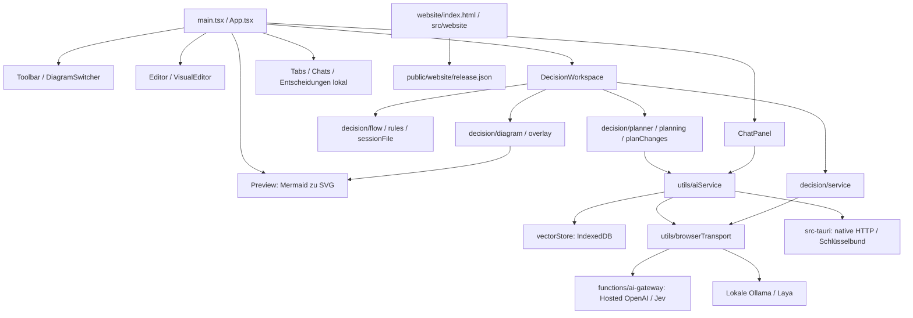

# Projektüberblick und aktueller Stand

Stand: 04.10.2026. Mermaider 1.8.7 verbindet Mermaid-Bearbeitung, KI-Chat und
interaktive Entscheidungen in einer Web-/Tauri-Anwendung. Der Nutzer hat die
aktuellen macOS-ARM64- und Windows-x64-Installer praktisch abgenommen und die
öffentliche MIT-Veröffentlichung autorisiert. Bestehende Fremdattribution bleibt.

| Bereich | Aktueller belegter Stand |
| --- | --- |
| App / Website | https://mermaider.appwrite.network/ und `/website/` bereitgestellt |
| Version / Lizenz | 1.8.7 / MIT |
| Desktop | Beide CI-Builds erfolgreich, Dateien und Prüfsummen geprüft, Nutzerabnahme bestätigt; unsigniert |
| Geprüfte Anwendung | `4108f4083e1e8311c37b7672d16f6426ac2bea48`; aktive Site `6ac262d4c945c1d52673` |
| AI-Gateway | Aktiv, Health 200 und gesperrtes Ziel 403 geprüft |
| Anbieter | OpenAI, Jev und Embeddings vom Nutzer geprüft; lokale Laya-Abnahme später |
| Decisions | Choice, Score, Noul, Live-State, Entwürfe, Review, Verlauf und opt-in Automatik; weiterhin Preview |
| Letzte Webänderung | Diagrammbibliothek in der oberen Toolbar, lokal gebaut und geprüft; Desktop-Dateien unverändert |
| Öffentliche Distribution | Autorisiert; tatsächliche Ausführung benötigt konfigurierte API-Zugänge, siehe [Veröffentlichung](PUBLICATION_1.8.7.md) |

Nachweise und Abnahmegrenzen: [Release-Abschluss](RELEASE_CLOSEOUT_1.8.7.md).
Die [Bestandsaufnahme vom 30.09.2026](PROJECT_OVERVIEW_2026-09-30.md) und ihr
[Statussnapshot](status-2026-09-30.json) bleiben als historische Referenz erhalten.
Dort genannte ursprüngliche Fehler und offene Prüfungen sind kein aktueller Status.

## Dateizusammenhänge

| Dateien / Gruppe | Verantwortung |
| --- | --- |
| `src/App.tsx` | Aktiver Tab, Code, Chat-/Entscheidungszustände, Layout, Kürzel und Vollbild |
| `Toolbar.tsx`, `DiagramSwitcher.tsx`, `Settings.tsx` | Aktionen, Bibliothekssuche, Provider-/Darstellungseinstellungen und Dialoge |
| `Editor.tsx`, `Preview.tsx` | Monaco-Eingabe, koordinierte Mermaid-Aufträge und direkte SVG-Interaktion |
| `VisualEditor.tsx`, `utils/mermaidParser.ts`, `mermaidModifier.ts` | Unterstützte Flowchart-Syntax bearbeiten und Originalcode erhalten |
| `DecisionWorkspace.tsx`, `DecisionRuleEditor.tsx`, `src/decision/` | Abläufe, Vorschläge, explizite Bewertung, Review und portable Dateien |
| `ChatPanel.tsx`, `utils/aiService.ts`, `vectorStore.ts` | Diagrammplanung, Providerzugriff, Kontext und Wissensbasis |
| `utils/browserTransport.ts`, `functions/ai-gateway/` | Gehostete Webanfragen über eingeschränkte Ziele; lokale Anfragen direkt |
| `src-tauri/` | Native Fenster/HTTP, Systemschlüsselspeicher, Bundle-Metadaten |
| `UserBlob.tsx`, `hooks/useBlobMotion.ts`, `useFloatingPanel.ts` | Persönlicher Blob, Bewegung und schwebende Arbeitsfenster |
| `src/mcp-server.ts`, `utils/mcpService.ts`, `mermaidTemplates.ts` | Stdio-MCP und gemeinsamer Vorlagenkontext |
| `website/`, `src/website/`, `public/website/` | Kleine Produktwebsite, Herkunft und geprüfte Downloadkonfiguration |
| `tests/`, `scripts/` | Logik-/Browserprüfungen, Deploymentprüfung und budgetfreie Veröffentlichung |
| `.github/workflows/` | Web-/Desktop-Builds und reguläre Deployments; für diesen Abschluss keine neuen Actions-Läufe |

150-ms-Eingabeverzögerung und verworfene veraltete Aufträge halten die Vorschau
aktuell. Pan/Zoom und Entscheidungsmarkierungen ändern SVG ohne neues Mermaid-Layout.
Weitere Performancearbeit wird anhand messbarer Fälle priorisiert.

Anleitungen: [Bedienung](WORKSPACE_UI.md), [Browser-AI](BROWSER_AI.md),
[Decisions](DYNAMIC_DECISIONS.md), [Bereitstellung](DEPLOYMENT.md).
Langfristige Erweiterungen stehen in der [Roadmap](ROADMAP.md).
