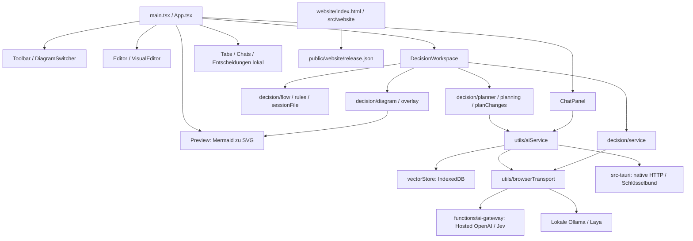

# Projektüberblick und aktueller Stand

Stand: 05.10.2026. Die Roadmap-Implementierung ist als Mermaider 1.9.1 Preview
veröffentlicht und im Web aktiv. MIT und die ursprüngliche Attribution bleiben erhalten.
Die praktische Nutzerabnahme gilt für die unveränderten stabilen 1.8.7-Installer;
für die neuen Dateien wird sie nicht behauptet.

| Bereich | Aktueller belegter Stand |
| --- | --- |
| App / Website | https://mermaider.appwrite.network/; DE und EN mit persistentem Language Switcher |
| Version / Lizenz | Web und neue Vorabversion 1.9.1 / MIT; stabile Downloads 1.8.7 |
| Desktop | CI-geprüfte unsignierte ARM64-/Windows-x64-Dateien öffentlich; Intel-Mac/Linux als separate geprüfte Build-Kandidaten |
| Quellstand | `3881c60dc41e8097b2a18b8586e32ca04b02b2ff`, unverändertes Tag `v1.9.1` |
| Aktive Site / Gateway | `6ac3ab70a54e0e49d1ac` / `6ac3ab5e76d1cb6228ce`; Health, Allowlist und Live-App geprüft |
| Anbieter | Historische OpenAI-/Jev-Abnahme; Laya-Server und reale Benchmarks vorbereitet, Einrichtung beim Nutzer |
| Decisions | Kombinierte Voraussetzungen, retained Snapshots, Vergleich/Bericht, reviewbare MCP/API-Updates und Vorlagen; Preview |
| Rendering / Bedienung | Lokal gebündelter Monaco-Worker, lazy Renderer/Editor, SVG-Cache, konfigurierbare Shortcuts |
| Transport | Optionales lokales SSE-Relay mit 180 Sekunden; gehostetes Appwrite bleibt 50 Sekunden/gepuffert |
| Verifikation | 62 Node-Tests, 53 Browserfälle vor Deployment, 54 live; 87 öffentliche Dateien bytegenau geprüft |

Nachweise: [Abschluss 1.9.1](RELEASE_CLOSEOUT_1.9.1.md),
[Roadmap und externe Grenzen](ROADMAP.md), [nächste Sitzung](NEXT_SESSION_1.9.1.md).
Historische Nachweise stehen im [1.8.7-Abschluss](RELEASE_CLOSEOUT_1.8.7.md) und
[Überblick vom 30.09.2026](PROJECT_OVERVIEW_2026-09-30.md).

## Dateizusammenhänge

| Dateien / Gruppe | Verantwortung |
| --- | --- |
| `src/App.tsx` | Aktiver Tab, Code, Chat-/Entscheidungszustände, Layout, Kürzel und Vollbild |
| `Toolbar.tsx`, `DiagramSwitcher.tsx`, `Settings.tsx` | Aktionen, Bibliothekssuche, Provider-/Darstellungseinstellungen und Dialoge |
| `Editor.tsx`, `Preview.tsx` | Monaco-Eingabe, koordinierte Mermaid-Aufträge und direkte SVG-Interaktion |
| `VisualEditor.tsx`, `utils/mermaidParser.ts`, `mermaidModifier.ts` | Unterstützte Flowchart-Syntax bearbeiten und Originalcode erhalten |
| `DecisionWorkspace.tsx`, `DecisionRuleEditor.tsx`, `src/decision/` | Abläufe, Vorschläge, explizite Bewertung, Review und portable Dateien |
| `ChatPanel.tsx`, `utils/aiService.ts`, `vectorStore.ts` | Diagrammplanung, Providerzugriff, Kontext und Wissensbasis |
| `utils/browserTransport.ts`, `functions/ai-gateway/` | Gehostete Webanfragen über eingeschränkte Ziele; lokale Anfragen direkt |
| `src-tauri/` | Native Fenster/HTTP, Systemschlüsselspeicher, Bundle-Metadaten |
| `UserBlob.tsx`, `hooks/useBlobMotion.ts`, `useFloatingPanel.ts` | Persönlicher Blob, Bewegung und schwebende Arbeitsfenster |
| `src/mcp-server.ts`, `utils/mcpService.ts`, `mermaidTemplates.ts` | Stdio-MCP und gemeinsamer Vorlagenkontext |
| `website/`, `src/website/`, `public/website/` | Kleine Produktwebsite, Herkunft und geprüfte Downloadkonfiguration |
| `tests/`, `scripts/` | Logik-/Browserprüfungen, Deploymentprüfung und budgetfreie Veröffentlichung |
| `.github/workflows/` | Web-/Desktop-Builds und reguläre Deployments; Budget wieder verfügbar; manuelle Release-/Plattform-/Signierungsabläufe |

150-ms-Eingabeverzögerung und verworfene veraltete Aufträge halten die Vorschau
aktuell. Pan/Zoom und Entscheidungsmarkierungen ändern SVG ohne neues Mermaid-Layout.
Weitere Performancearbeit wird anhand messbarer Fälle priorisiert.

Anleitungen: [Bedienung](WORKSPACE_UI.md), [Browser-AI](BROWSER_AI.md),
[Decisions](DYNAMIC_DECISIONS.md), [Bereitstellung](DEPLOYMENT.md).
Langfristige Erweiterungen stehen in der [Roadmap](ROADMAP.md).
