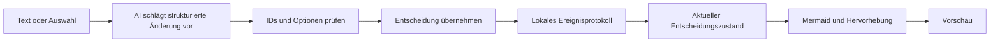

# Roadmap: Release, Website und Live-Entscheidungen

Stand: 30.09.2026. Erster Lauf: Projekt verstehen, Build prüfen und
Bereitstellung vorbereiten. Produktziel: Ideen, Entscheidungen und Abläufe
als visuelle Kommunikationsgrundlage darstellen.

## 1. Vorhandene Anwendung bereitstellen

Verifizierten Webbuild übergeben, CI-Artefakte bereitstellen, Appwrite-Pipeline
korrigieren, Ziel-Site konfigurieren und echte Aktivierung prüfen. Für Installer
eine öffentliche Release-/Downloadquelle bestimmen. Lokale Vorbereitungen
liegen vor; tatsächliches Deployment und öffentliche Distribution stehen aus.

## 2. Release-Ready Build

- Auditmeldungen bewerten und kompatible Abhängigkeitsupdates prüfen;
  Mermaid-Majorwechsel getrennt betrachten.
- Fehler, schnelle Eingaben, Tabwechsel, Persistenz, Import/Export und
  AI-Ergebnisübernahme gezielt gegen Regressionen absichern.
- Rendering von Chat-/Layoutänderungen entkoppeln, veraltete Ergebnisse
  verwerfen und Parsefehler kontrolliert behandeln.
- Flowchart-Teilparser und MCP-Schemata vor automatisierter Nutzung korrigieren.
- npm, Lockfiles, Tauri, Rust und Installer versionsgleich halten; den
  bestehenden v1.8.6-Tag nicht wiederverwenden.
- Pipeline mit `npm ci`, expliziten Architekturen und einmaliger Erstellung
  des Releaseentwurfs. Das bisherige Löschen von Entwürfen in beiden Matrixjobs
  birgt Konkurrenz zwischen Upload und Löschung.
- Auf macOS/Windows Installation, Start, lokale Modelle, OpenAI-Anmeldung,
  Credential-Persistenz und Export prüfen.
- Signierung/Notarisierung bzw. klare Angaben zu unsignierten Installern,
  Release Notes und Prüfsummen vorbereiten.

Ergebnis: Neuer geprüfter Release, dessen Version, Commit und funktionierende
Downloads zusammenpassen. Ein Compilerlauf allein genügt nicht.

## 3. Minimale moderne Website

Leichte eigene Produktseite: ein Satz zum Nutzen, echtes Diagrammbeispiel,
„Im Browser öffnen“, „Herunterladen“ und sichtbarer GitHub-Link. Drei kurze
Fähigkeiten: Text zu Diagramm, lokal arbeiten, visuell kommunizieren.
Zurückhaltende Typografie, Freiraum, geringe Animation, responsive Darstellung
und Tastaturbedienbarkeit. Geprüfte Metadaten und Lizenz-/Kontaktangaben.

Downloadbuttons zeigen Betriebssystem, tatsächlich vorhandene Architektur,
Version und Release Notes. Erst öffentliche veröffentlichte Artefakte verlinken.
Keine GitHub-Zugangsdaten im Browser hinterlegen.

Vorschlag: `/` für Produktseite, `/app/` für Anwendung. Heutige Root-Pfade,
Diagrammhilfen, Bookmarks und Browser-Speicherdaten bei der Umstellung prüfen.
Die Produktseite soll große Editor-/Diagrammbibliotheken erst beim Appstart laden.
Getrennte Einstiegspunkte, gemeinsam deploybar; konkrete Downloadlinks hängen
von Host und öffentlicher Releasequelle ab.

## 4. Jev und Laya als Entscheidungsprovider

Präzisierung vom 01.10.2026: Beide Betriebsarten integrieren, analog zu Ollama
und OpenAI: [Jev gehostet](https://jevmodel.org/docs/) und
[Laya lokal](https://huggingface.co/convaiinnovations/laya), installiert über
[PyPI](https://pypi.org/project/laya/). Der Entscheidungsprovider wird unabhängig
vom Chat-/Codegenerierungsprovider gewählt.

Laya 0.3.22 bietet einen Jev-kompatiblen HTTP-Vertrag (`POST /v1/systemone`).
Das offizielle TypeSafe-SDK bestätigt diesen Endpunkt für Jev. Gemeinsame
Primitive sind `choice`, `score` und `noul`; Konfidenzmetadaten und Schwellenwerte
werden providerabhängig behandelt. Architektur, Quellen, Credential-/Transport-
fragen und Abnahmeschritte stehen in [DECISION_PROVIDERS.md](DECISION_PROVIDERS.md).
Die technische Integration ist noch nicht implementiert.

Beispiel: „Budget freigegeben“ aktiviert im Diagramm „Umsetzung starten“;
die Alternative „Rückfrage“ bleibt sichtbar. Antworten beider Provider werden
anhand stabiler IDs auf Diagrammzustände und sichtbare Pfade abgebildet.

Das fachliche Modell enthält stabile IDs für Entscheidungen, Optionen, Aktionen
und Verbindungen, dazu ein Ereignisprotokoll mit Zeitpunkt, gewählter Option
und optionaler Begründung. Aktueller Zustand und Historie werden getrennt vom
Mermaid-Quelltext gespeichert. Mermaid ist die exportierbare Darstellung.

Bekannte Optionen unmittelbar deterministisch anwenden. Ein Klick auf
„freigegeben“ braucht keinen Modellaufruf. AI interpretiert neue Texte;
mehrdeutige Aussagen erzeugen bearbeitbare Vorschläge.

MVP: benannte Entscheidung mit zwei Optionen, aktiver Pfad,
Rückgängig/Wiederholen, lokale Historie, Mermaid-/SVG-Export. Später:
Bedingungen, mehrere Optionen, Ablaufzustände, Historienwiedergabe,
strukturierter Import und externe Ereignisse über MCP/API.

Auswertung und Diagrammregeln bleiben explizit in der Anwendung. Die gemeinsame
Antwortstruktur erhält Provider, Modellversion, Verteilungen und Konfidenz-
bedeutung. Ein lokaler Providerfehler führt nicht still zu einer Cloudanfrage.

## Rendering verbessern

Zuerst kleine/mittlere/große Diagramme messen: Eingabe bis Vorschau,
Layoutdauer, Renderanzahl und Speicherbedarf. Anschließend:

1. Stabile Callback-/Zustandsgrenzen; Chat und Pan/Zoom lösen keine identische
   Layoutberechnung aus.
2. Renderaufträge koordinieren, Zwischenstände zusammenfassen und überholte
   Ergebnisse auch bei Fehlern verwerfen; kurze Verzögerung für bestätigte
   Entscheidungen, längere für freie Codeeingabe.
3. Inhalt-/Konfigurationscache und bedarfsgerechtes Laden schwerer Diagrammtypen.
4. Bei unveränderter Topologie nur aktiven Pfad/Status aktualisieren.
5. Worker für DOM-unabhängige Modell-/Parserarbeit bewerten; Mermaid-SVG
   benötigt im aktuellen Aufbau DOM und Textmessung.

Vorgeschlagene, noch nicht validierte Ziele auf einem definierten Referenzrechner:
Statushervorhebung unter 100 ms, kleines Diagramm unter 250 ms nach bestätigter
Entscheidung, keine veralteten Ergebnisse bei schnellen Folgeentscheidungen.
AI-Latenz separat messen. Vorhandene Mermaid-Dateien und Chats weiterhin unterstützen.

## Stabilisierung – aktueller Stand

Rendering, Visual-Parser/-Modifier, Persistenz, MCP-Schemas, npm-Abhängigkeiten
und Release-Pipeline sind lokal korrigiert und automatisiert geprüft. Native
Zielsystemprüfungen und Veröffentlichung bleiben offen. Details und Abnahme:
[RELEASE_STABILIZATION.md](RELEASE_STABILIZATION.md).
